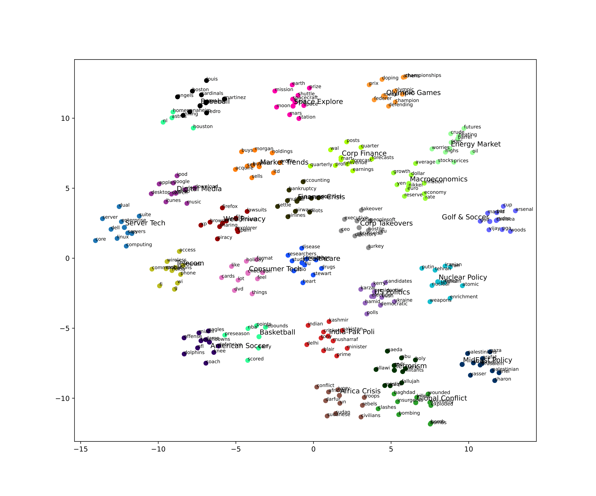

# Exploring-Topic-Embeddings
With the advent of embedding-based topic models, topic embeddings have emerged, representing an entire topic with a single embedding vector. However, apart from qualitative evaluations, these embedding vectors and their applications have not been further explored in the literature. In this paper, we leverage the Embedded Topic Model (ETM) with Dirichlet priors to generate topic embeddings. We then explore the use of topic embeddings for semantic understanding and analyze the interactions between topic-topic and topic-word embeddings. This exploration sheds light on several esoteric topics, enhancing our understanding of the corpus. Additionally, we propose a novel technique for learning document embeddings by aggregating topic embeddings at the document level. We benchmark these document embeddings against established GloVe-based document embeddings and the powerful sentence transformer-based document embeddings. Our comprehensive experiments utilize the 20 Newsgroups and AG News datasets, employing a classification task as a robust evaluation metric. The results demonstrate that the proposed document embeddings outperform GloVe and remain competitive against sentence transformers, despite having relatively fewer trainable parameters and datasets. These findings open up new avenues for future research in information retrieval and semantic textual similarity (STS) tasks using topic embeddings.

# Topics-Word from ETM model 
##  Category 1: Topic Labels of 20NG
Here's a list of topics and their associated words for the first category.

- **ArmeniaHistory:** turkish, genocide, armenian, turks, armenia, turkey, argic, armenians, muslim, serdar
- **Religion:** atheists, belief, conclusion, religious, morality, moral, atheist, beliefs, religion, evidence
- **Internet:** requests, anonymous, motif, servers, server, widget, pub, privacy, resource, export
- **Graphics Software:** gif, dos, shareware, image, format, windows, formats, version, printer, graphics
- **US Politics:** president, q, jobs, bush, spending, funds, mr, consideration, george, clinton
- **Ice Hockey:** la, leafs, rangers, louis, kings, philadelphia, playoff, jersey, montreal, detroit
- **Electronics:** apple, connected, voltage, circuit, wire, ground, clock, cable, cpu, panel
- **Automobiles:** mph, bikes, bike, ride, cars, car, ford, oil, rear, engine
- **Product Sales:** manuals, stereo, shipping, sale, condition, offer, brand, disks, excellent, warranty
- **Software Compilation:** x, entry, stream, xterm, compile, output, window, visual, widget, rules
- **Incident:** standing, afraid, parents, woman, happened, burned, knew, saw, went, koresh
- **Sports:** players, pitching, gm, season, fans, nhl, teams, score, defensive, team
- **Violence:** gun, guns, firearms, violent, crime, deaths, crimes, weapon, amendment, weapons
- **Encryption:** encrypted, clipper, escrow, des, encryption, enforcement, classified, nsa, crypto, secure
- **Middle East Politics:** israeli, israel, jews, arabs, islamic, peace, islam, israelis, arab, civilians
- **Computer Hardware:** bios, controller, disk, scsi, floppy, ide, mb, drives, os, feature
- **Space Mission:** lunar, launch, mission, nasa, satellite, space, shuttle, solar, moon, orbit

  

  ## Category 2: Topic Labels of Ag News
Here's a list of topics and their associated words for the "Ag News" category.

- **Server Tech:** linux, server, os, dell, servers, computing, dual, core, enterprise, suite
- **Market Trends:** stake, holdings, buys, buy, acquire, sell, ltd, sells, profile, morgan
- **Global Conflict:** clashes, wounding, bombs, exploded, killed, bomb, baghdad, bombing, insurgents, wounded
- **India-Pak Poli:** blair, cricket, delhi, pakistan, kashmir, prime, musharraf, minister, indian, tony
- **US Politics:** bush, karzai, kerry, democratic, election, polls, presidential, ukraine, hamid, candidates
- **Africa Crisis:** sudan, sudanese, darfur, ivory, un, troops, rebels, african, civilians, conflict
- **Consumer Tech:** format, like, dvd, holiday, don, lot, check, feel, cards, things
- **Corp Takeovers:** peoplesoft, takeover, brussels, oracle, eu, ceo, directors, executive, hostile, turkey
- **Telecom:** mobile, wireless, fi, communications, access, nokia, g, wi, phones, phone
- **Nuclear Policy:** iran, nuclear, uranium, atomic, tehran, enrichment, korea, iranian, weapons, putin
- **Healthcare:** drug, study, disease, insurance, heart, radio, researchers, flu, drugs, stewart
- **Corp Finance:** profit, quarterly, earnings, quarter, forecast, mart, wal, revenue, posts, forecasts
- **Space Explore:** space, spacecraft, shuttle, moon, nasa, mars, earth, prize, station, mission
- **Baseball:** sox, yankees, anaheim, angels, martinez, pedro, boston, cardinals, inning, louis
- **Energy Market:** futures, barrel, oil, crude, prices, heating, opec, highs, stocks, worries
- **Golf & Soccer:** cup, ryder, pga, woods, vijay, golf, chelsea, par, arsenal, madrid
- **Digital Media:** msn, google, ipod, apple, itunes, yahoo, search, desktop, download, music
- **Olympic Games:** olympic, athens, championships, finals, federer, medal, champion, prix, defending, doping
- **Macroeconomics:** dollar, inflation, average, growth, rate, euro, economy, nikkei, yen, reserve
- **Basketball:** nl, astros, scored, rebounds, homer, barry, nba, points, preseason, houston
- **Web Privacy:** firefox, explorer, browser, xp, piracy, infringement, file, lawsuits, sharing, spam
- **Terrorism:** cleric, qaeda, muslim, abu, militants, allawi, holy, sadr, fallujah, iraqi
- **Finance Crisis:** bankruptcy, airways, pension, airlines, mutual, securities, yukos, accounting, settle, pilots
- **MidEast Policy:** gaza, ariel, sharon, arafat, palestinians, israeli, jerusalem, palestinian, yasser, strip
- **American Soccer:** miami, dame, touchdowns, offense, dolphins, eagles, coach, nfl, defensive, knee

   
